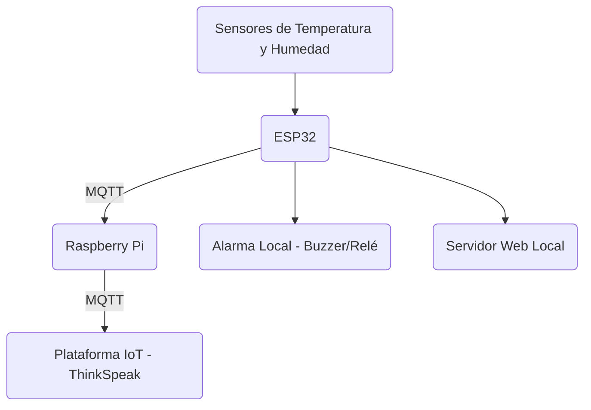

### Diagrama de bloques 

```mermaid
graph TD
    A(Sensores de Temperatura y Humedad) --> B(ESP32)
    B -->|MQTT| C(Raspberry Pi)
    C -->|MQTT| D(Plataforma IoT - ThinkSpeak)
    B --> E(Alarma Local - Buzzer/Relé)
    B --> F(Servidor Web Local)
```