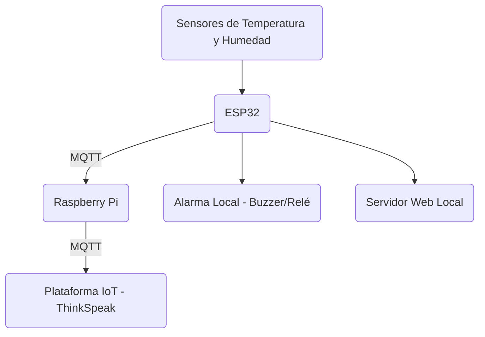

# Monitorización de Incubadoras Neonatales mediante IoT

Este repositorio contiene el código y la documentación de un sistema IoT diseñado para la monitorización en tiempo real de las condiciones ambientales dentro de incubadoras neonatales. Utilizando un ESP32 y una Raspberry Pi, el sistema recolecta y transmite datos de temperatura y humedad para su visualización local y remota. Además, el sistema genera alertas en caso de anomalías, lo que permite una rápida intervención.

## Tabla de Contenidos
1. [Descripción General](#descripción-general)
2. [Arquitectura del Sistema](#arquitectura-del-sistema)
3. [Instalación](#instalación)
   1. [Configuración del ESP32](#configuración-del-esp32)
   2. [Configuración de la Raspberry Pi como Gateway IoT](#configuración-de-la-raspberry-pi-como-gateway-iot)
4. [Uso del Sistema](#uso-del-sistema)
   1. [Monitorización Local](#monitorización-local)
   2. [Monitorización Remota](#monitorización-remota)
5. [Protocolo de Pruebas](#protocolo-de-pruebas)
6. [Contribuciones](#contribuciones)
7. [Referencias](#referencias)

---

## Descripción General

Este proyecto busca mejorar la supervisión de las condiciones críticas dentro de una incubadora neonatal, permitiendo la vigilancia remota mediante el uso de tecnologías IoT. El sistema se basa en un **ESP32** que recolecta datos de temperatura y humedad, transmitiéndolos a una **Raspberry Pi** que actúa como gateway IoT y envía los datos a una plataforma en la nube.

### Motivación

Los neonatos requieren condiciones ambientales muy específicas para su bienestar. Este sistema permite la monitorización constante de dichas condiciones, emitiendo alertas tanto locales como remotas cuando los valores de temperatura y humedad se salen de los rangos aceptables.

---

## Arquitectura del Sistema

El sistema tiene los siguientes componentes:

- **ESP32**: Recoge datos de los sensores de temperatura y humedad, y gestiona el servidor web embebido para la monitorización local.
- **Raspberry Pi**: Funciona como Gateway IoT, recepcionando los datos a través de MQTT y retransmitiéndolos a la nube (ej. ThinkSpeak).
- **Plataforma IoT**: Utilizada para la visualización remota de datos y la generación de alertas.

### Diagrama de Componentes



---

## Instalación

### Requisitos

1. **ESP32**
2. **Raspberry Pi** con Raspbian OS
3. Sensores de temperatura y humedad (DHT11 y DS18B20)
4. Plataforma IoT (ej. ThinkSpeak)

### Configuración del ESP32

1. Instala el [Arduino IDE](https://www.arduino.cc/en/software).
2. Asegúrate de tener instaladas las bibliotecas necesarias:
   - WiFi.h
   - PubSubClient.h (para MQTT)
   - DHT.h (para el sensor de humedad)
   - DallasTemperature.h (para el sensor DS18B20)

3. Configura tu archivo de código con tus credenciales WiFi y la dirección IP del broker MQTT (Raspberry Pi).

4. Carga el código en el ESP32 desde el Arduino IDE.

### Configuración de la Raspberry Pi como Gateway IoT

1. Actualiza el sistema operativo de la Raspberry Pi:

```bash
sudo apt update
sudo apt upgrade
```

2. Instala el broker MQTT Mosquitto:

```bash
sudo apt install mosquitto mosquitto-clients
sudo systemctl enable mosquitto
sudo systemctl start mosquitto
```

3. Configura la Raspberry Pi para recibir datos del ESP32 y enviarlos a la plataforma IoT (ej. ThinkSpeak). Para ello, puedes usar el siguiente script en Python que se ejecutará en la Raspberry Pi:

```python
import paho.mqtt.client as mqtt
import requests

THINGSPEAK_API_KEY = "YOUR_THINGSPEAK_WRITE_API_KEY"
THINGSPEAK_UPDATE_URL = "https://api.thingspeak.com/update"

def on_message(client, userdata, msg):
    try:
        payload = msg.payload.decode()
        print(f"Mensaje recibido: {payload}")
        values = payload.split(", ")
        temp_ext = float(values[0].split("=")[1])
        temp_axil = float(values[1].split("=")[1])
        hum = float(values[2].split("=")[1])

        data = {
            'api_key': THINGSPEAK_API_KEY,
            'field1': temp_ext,
            'field2': temp_axil,
            'field3': hum
        }
        response = requests.post(THINGSPEAK_UPDATE_URL, data=data)

        if response.status_code == 200:
            print("Datos enviados a ThinkSpeak exitosamente.")
        else:
            print(f"Error enviando datos a ThinkSpeak: {response.status_code}")

    except Exception as e:
        print(f"Error procesando mensaje MQTT: {e}")

def on_connect(client, userdata, flags, rc):
    print(f"Conectado al broker MQTT con código de resultado {rc}")
    client.subscribe("incubadora/data")

client = mqtt.Client()
client.on_connect = on_connect
client.on_message = on_message

client.connect("localhost", 1883, 60)

client.loop_forever()
```

---

## Uso del Sistema

### Monitorización Local

El **ESP32** tiene un servidor web embebido que muestra en tiempo real los datos de los sensores. Para acceder a él, ingresa la dirección IP asignada al ESP32 en tu navegador web dentro de la red local. Los datos se actualizan automáticamente cada segundo.

### Monitorización Remota

El sistema también permite la visualización remota de los datos a través de la plataforma **ThinkSpeak**. Puedes configurar alertas que se disparen cuando los valores de los sensores exceden los límites predefinidos.

---

## Protocolo de Pruebas

### 1. Conectividad WiFi del ESP32

1. Inicia el ESP32 y verifica en el monitor serial que se conecta correctamente a la red WiFi.
2. Asegúrate de que la dirección IP asignada sea visible en la salida.

### 2. Comunicación MQTT

1. Inicia el ESP32 y asegúrate de que los datos de los sensores se publican correctamente en el tema MQTT `incubadora/data`.
2. Verifica en la Raspberry Pi que los datos se reciben y se envían a ThinkSpeak.

---

## Contribuciones

Si deseas contribuir a este proyecto, por favor sigue estos pasos:

1. Haz un fork del repositorio.
2. Crea una nueva rama (`git checkout -b feature/nueva-caracteristica`).
3. Realiza tus cambios y haz commit (`git commit -m 'Añadida nueva característica'`).
4. Empuja los cambios a tu rama (`git push origin feature/nueva-caracteristica`).
5. Crea un Pull Request.

---

## Referencias

1. **Arduino** - Documentación oficial sobre la biblioteca WiFi: [Arduino WiFi](https://www.arduino.cc/en/Reference/WiFi)
2. **Mosquitto MQTT** - Guía de instalación y configuración: [Mosquitto](https://mosquitto.org/)
3. **ThinkSpeak** - Plataforma IoT para visualización de datos: [ThinkSpeak](https://thingspeak.com/)
